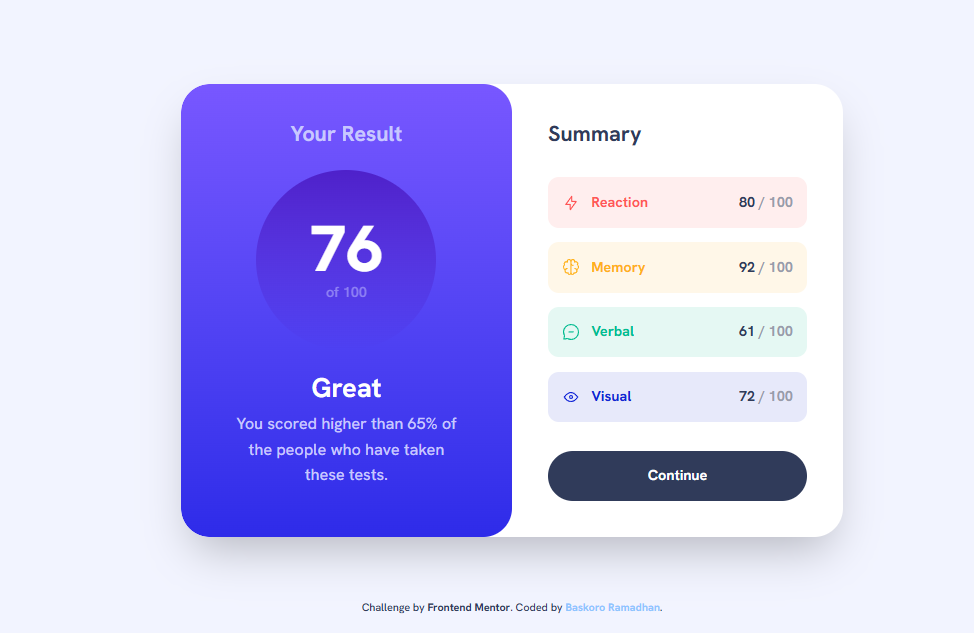
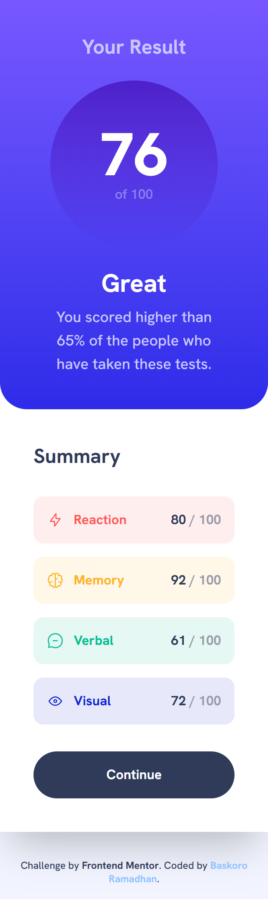

# Frontend Mentor - Results summary component solution

This is a solution to the [Results summary component challenge on Frontend Mentor](https://www.frontendmentor.io/challenges/results-summary-component-CE_K6s0maV). Frontend Mentor challenges help you improve your coding skills by building realistic projects.

## Table of contents

- [Overview](#overview)
  - [The challenge](#the-challenge)
  - [Screenshot](#screenshot)
  - [Links](#links)
- [My process](#my-process)
  - [Built with](#built-with)
  - [What I learned](#what-i-learned)
  - [Useful resources](#useful-resources)
  - [AI Collaboration](#ai-collaboration)
- [Author](#author)

## Overview

### The challenge

Users should be able to:

- View the optimal layout for the interface depending on their device's screen size
- See hover and focus states for all interactive elements on the page
- **Bonus**: Use the local JSON data to dynamically populate the content

### Screenshot

|            Desktop Version            |           Mobile Version            |
| :-----------------------------------: | :---------------------------------: |
|  |  |

### Links

- Solution URL: [GitHub Repository](https://github.com/BaskoroR725/27-Result-summary-components)
- Live Site URL: [Vercel / GitHub Pages](https://github.com/BaskoroR725)

## My process

### Built with

- Semantic HTML5 markup
- Mobile-first workflow
- **React** (Functional Components & Hooks)
- **TypeScript**
- **Tailwind CSS v4**
- **Bun** (Fast JavaScript runtime & package manager)
- **Vite** (Build tool)

### What I learned

During this project, I learned how to efficiently map through JSON data using React's `.map()` function and how to manage styles dynamically using a lookup table (`categoryConfig`). This made the code much cleaner and easier to maintain.

```tsx
// Example of dynamic mapping with a lookup table
const categoryConfig: Record<
  string,
  { bg: string; text: string; icon: string }
> = {
  Reaction: {
    bg: "bg-[hsla(0,100%,67%,0.1)]",
    text: "text-[#ff5757]",
    icon: iconReaction,
  },
  // ... other categories
};

{
  data.map((item) => {
    const config = categoryConfig[item.category];
    return (
      <li
        key={item.category}
        className={`flex justify-between items-center p-4 ${config.bg} rounded-xl`}
      >
        {/* ... content */}
      </li>
    );
  });
}
```

### Useful resources

- [Tailwind CSS Documentation](https://tailwindcss.com/docs) - Always a go-to for checking arbitrary values and responsive utilities.
- [React Mapping Guide](https://react.dev/learn/rendering-lists) - Helpful for refreshing memory on keys and list rendering.

### AI Collaboration

This project was built with the assistance of **Antigravity (Google DeepMind)**.

- **Guidance**: Used for architectural decisions like the `Record` type lookup table.
- **Debugging**: Helped in fixing responsive layout issues with the attribution footer.
- **Teaching**: Provided clear explanations of technical concepts during development.

## Author

- Frontend Mentor - [@BaskoroR725](https://www.frontendmentor.io/profile/BaskoroR725)
- GitHub - [Baskoro Ramadhan](https://github.com/BaskoroR725)
